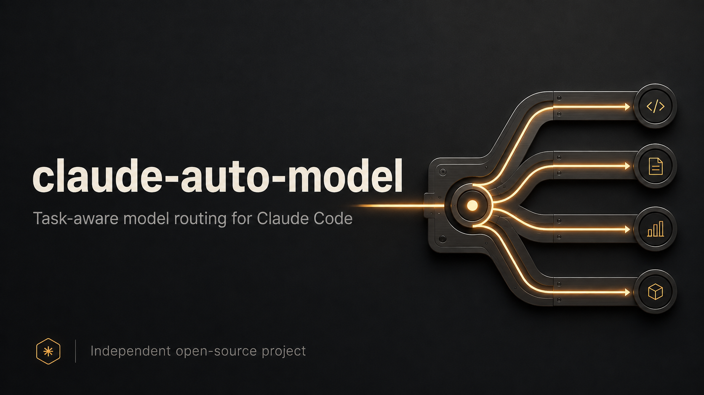
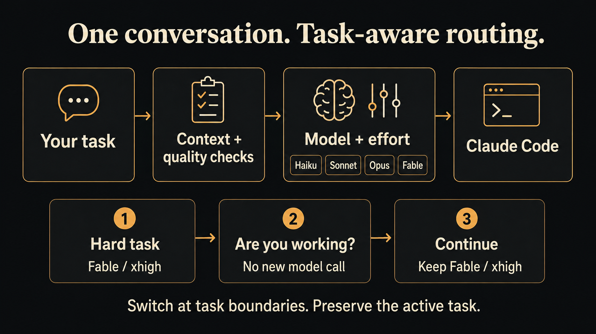

# claude-auto-model



Automatically select Claude Code's model and effort before every task in the
same conversation. Start `claude` once and keep chatting.

This version replaces the original launch-only zsh classifier with a small
Python terminal controller. It runs the real Claude Code engine continuously and
uses its supported `set_model` and `apply_flag_settings` controls. The active
model and effort are verified before your prompt is sent.

**Public beta.** Real mid-session switching is implemented and tested. Routing
judgment is probabilistic, account access still applies, and savings are not yet
measured on real workloads. This is an independent project, not an Anthropic product.

## Install

Requires macOS or Linux, Python 3.10+, and Claude Code with a working login.
Verified against Claude Code **2.1.263**. Run `ca-doctor` after CLI updates.

```sh
git clone https://github.com/hodkovickybuh/claude-auto-model.git
cd claude-auto-model
python3 -m unittest discover -v
python3 install.py
```

Open a new zsh terminal, then run `claude` normally. The installer archives your
previous `.zshrc`, replaces the old router's source line if present, and leaves
unrelated shell configuration intact. Re-running it is idempotent.
If `ZDOTDIR` is set, its `.zshrc` is used. `--shell-file PATH` overrides that choice.
Keep this checkout in place: the shell sources it directly. Updating the checkout
updates new routed sessions; existing sessions keep their loaded code.

Without installing:

```sh
python3 auto_model.py
python3 auto_model.py "your first task"
```

The interface is plain text. Claude retains its session, tools, project
instructions, hooks, plugins, MCPs, and normal permission rules. It is **not
Claude's original full-screen terminal UI**. Native pickers, image pasting,
terminal shortcuts, and other UI-only features remain available through
`_claude_stock` or `ca --native`. This cannot attach automatic routing to an
already-running original terminal session.

## Routing



| Tier | Default model | Effort | Work |
|---|---|---|---|
| XS | Haiku | No adaptive effort setting | Small factual lookups |
| S | Sonnet | low | Typos and obvious mechanical changes |
| M | Sonnet | high | Normal features, debugging, research and content |
| L | Opus | high | Difficult analysis, architecture, security, financial or legal work |
| XL | Fable | xhigh | Novel systems, unresolved severe failures, exceptionally difficult reasoning |

On the tested CLI, the aliases resolve to Haiku 4.5, Sonnet 5, Opus 5 and
Fable 5.1. Provider configuration, model availability and future CLI versions can
change alias resolution.

A separate tool-free Haiku request classifies each substantive task with bounded
recent context and a retained active-task anchor. Status questions such as
"are you workign?" and "pracujes?" are answered locally, with no inference or
model change. "Yes continue" keeps the active model and effort without a
classifier call. Uncertain follow-ups cannot automatically downgrade the active
model; genuinely new tasks can. Fable is a real automatic choice.

There are two distinct jobs: Haiku **classifies** the request; the selected model
**executes** it. A Haiku classifier call does not mean Haiku is doing your hard task.
The classifier has no tools, hooks, plugins or MCPs. Its output is validated.

Independent quality checks then apply:

- Automatic Haiku needs both an XS classification and a conservatively recognized
  bounded lookup. Vague work or implementation accidentally labeled XS moves to Sonnet/high.
- Recognized explicit deepest-reasoning requests have a Fable/xhigh floor, even
  if the classifier returns XS or fails. Recognized sensitive work has an Opus floor.
- Quoted examples, code and negated requests cannot create these keyword floors.
  These are bounded text checks, not a complete natural-language understanding system.
- A current explicit model choice wins. Asking for Haiku manually bypasses the
  automatic quality floor. A model-only Fable request defaults to xhigh effort.
- Status checks and simple continuations retain both model and effort. An
  ambiguous relationship to the active task also cannot lower either automatically.
  A recognized substantive follow-up can adapt effort while retaining its model floor.

For example: start a difficult protocol design on Fable/xhigh, ask "are you
working?", then say "continue". The status reply is local and continuation stays
on Fable/xhigh. "New task: fix this README typo" allows a downgrade, subject to
cache cost. An assistant finishing one answer does not automatically retire the task.

Classification failures fall back to Opus/high, while preserving clear explicit
model/effort directives. Automatic Haiku selection is avoided once observed
conversation context reaches 160,000 tokens. Before a warm-cache downgrade, a
one-turn heuristic compares estimated refill cost with expected output savings.
It can keep the previous model at lower effort. The five-minute estimate uses
published default-model prices, not provider billing or observed future output;
custom model prices are not guessed. Manual choices bypass it.
The context estimate follows the latest main-model request, so compaction can
reduce it. Child-agent usage does not overwrite the parent's context estimate.

Classification adds latency and consumes your normal Claude allowance or API
credits. `/cost` shows Claude's current-run reported estimate separately from
the accumulated cost of classifier calls. Failed classifier calls may have
unreported spend. Model switches can invalidate prompt caches. This is task-based
selection, not a guarantee that switching will always save money or that the
classifier will always judge difficulty correctly.

The automatic ladder covers four Claude families, not every model from every
provider. `/models` lists what your installation advertises. An explicit
unavailable choice errors. A rejected automatic choice can fall back to Opus
with a visible explanation, never secretly finish a Fable task on Haiku. The
controller checks the applied model and effort before sending the task; an
unacknowledged or mismatched change stops it. Upstream runtime fallback policies
can still act after submission and are outside this routing check.

## Manual choices

```sh
claude --model opus --effort max
claude "your task" --model opus --effort max
claude --continue
claude --resume SESSION_ID
```

Model and effort flags are independent session pins. Both pinned means no
classification is needed. Clear leading directives such as "Use Fable 5.1 at max
effort for this task." are parsed before inference. With both choices present,
the classifier is skipped. Other plain-language choices need a recognizable
unquoted directive; use `/model` and `/effort` for unambiguous control.
These overrides apply to that turn unless a session pin already
fixes the setting. Quoted model names are not treated as commands.

Inside a routed session:

```text
/model opus        Pin model
/effort max        Pin effort
/model auto        Release only the model pin
/effort auto       Release only the effort pin
/auto              Release both pins
/status            Show applied settings, pins and session ID
/models            Show the installation's advertised models
/cost              Show reported engine and classifier cost, not promised savings
/paste             Multi-line input, finish with a line containing only a dot
/quit              Exit
```

Bracketed multi-line paste is accepted as one task on terminals that support it.
The POSIX reader drains input while Claude works, avoiding macOS canonical line
limits and partial-paste stalls. It supports UTF-8 and backspace, not a full
shell editor with cursor movement and history. Use `/paste` when bracketed paste
is unavailable.
Ctrl+C interrupts the current task. Permission requests display the actual tool
input and require `yes CODE`, using a fresh displayed code for that request.
An earlier queued `yes` is not approval. Collected question answers also require
confirmation. Without an interactive terminal, requests
needing approval are denied. Unknown host controls are never automatically
approved.

During a running turn, status checks are local. Other input queues for the next
turn; it cannot downgrade a model halfway through its answer. Background result
events are correlated separately from the foreground turn. Background permissions
are serviced while waiting for input, and cancelled approvals stop waiting.

`--resume ID` restores a routed session's task anchor from a private mode-600
sidecar under `~/.local/state/claude-auto-model/`. It contains the initial task
text (up to 8,000 characters), route and context estimate, not the full transcript.
`CA_STATE_DIR` changes that directory. `--no-session-persistence` disables these
writes too. Native sessions and `--continue` without matching router metadata
conservatively retain the initialized model for short follow-ups; Claude still
loads their full transcript. Native `/clear`, `/new` and `/reset` clear the
router anchor after successful completion.

Unrecognized terminal options fail explicitly. Use `_claude_stock` for native
flags or UI commands the controller does not expose. Provider-specific wrappers
that invoke `command claude` keep their existing behavior.

## Subagents

The PreToolUse callback routes Agent/Task calls using the delegated task, not
the parent's complexity.

- General-purpose children select registered `auto-xs` through `auto-xl`
  definitions, which carry the appropriate model and effort.
- Explicit model arguments are preserved.
- Specialized agent types keep their definitions and frontmatter effort while
  missing model selections can be routed.
- Resumed agents and forks keep Claude's native configuration.
- Agent calls have no effort argument. The router does not inject one.
- Exact subagent versions or effort overrides requiring an unregistered
  definition are refused explicitly.
- Workflow and other orchestration tools retain their own schemas and routing.
  The appended [guidance](TIERING.md) covers those; they are not intercepted.

The parent still decides whether to delegate and what each child should do.
Routing does not automatically split every task into agents or judge their final
answers. A lookup child can use Haiku while an independent hard child uses Fable.

## Verification

```sh
ca-test                         # Offline regression tests, no inference
ca-doctor                       # Live control support, no inference
python3 verify_live.py          # Paid synthetic five-turn routing/memory check
python3 verify_live.py --subagent # Paid synthetic real Agent callback check
python3 verify_live.py --resume   # Paid restart/resume check with a CSS preference
python3 eval_routing.py           # Validate hand-labeled cases, no inference
python3 eval_routing.py --live --output report.json # Paid routing evaluation
```

The live five-turn check has passed:
**Haiku -> Opus 5 -> Sonnet 5 -> Fable 5.1 -> Haiku**, with one process,
one session ID, observed response model IDs and retained conversation memory.
The real subagent check routed a typo correction to the Sonnet/low definition
and completed it.
An interactive continuity check kept Fable/xhigh for a status check and short
continuation, then chose Haiku for an unrelated question. No percentage savings
or "best model" quality claim is inferred from these synthetic checks.
Restart/resume retained a user's CSS color preference, and a real permission
callback required approval before running a harmless print command. A separate
Opus/max marker probe received an upstream safeguards refusal; that error was
surfaced, not silently retried on a different model.

The fixed [32-case corpus](eval_cases.json) includes English and Czech tasks,
ambiguous continuations, new tasks after hard work, explicit choices, quoted
model names and large context. Reports include individual misses, classifier
errors, latency, reported cost and source hashes. Fallbacks count as evaluation
failures even when their safe tier is acceptable. This is a small development
corpus, not an independent benchmark or proof of general routing accuracy.

The [initial report](docs/routing-evaluation-initial.json) is retained alongside
the [post-fix report](docs/routing-evaluation.json) and the
[final reviewed run](docs/routing-evaluation-reviewed.json). Offline GitHub Actions checks
run on macOS and Ubuntu with Python 3.10 and 3.14, without inference credentials.

On 2026-09-08, the initial live run agreed with 26/32 labels. Five simple lookups
were conservatively over-routed and one classifier call timed out to Opus. After
fixing those lookup patterns, the same corpus passed 32/32 with no timeouts.
The post-fix run reported $0.205463 in classifier cost and a 9.83-second median
per-case latency (24.71 seconds maximum, two concurrent evaluation workers).
After the independent review fixes, a third full run again passed 32/32, reporting
$0.204268 and an 11.31-second median (22.90 seconds maximum). The offline suite
passes 126 tests, including actual PTY input and child-process cleanup checks.
These are development-set results, not held-out accuracy. Classifier startup and
inference latency remain a material usability limitation for tiny tasks.

Print mode keeps routing diagnostics on stderr:

```sh
claude -p --output-format json "your task"
printf 'your task' | python3 auto_model.py -p
printf 'document contents' | python3 auto_model.py -p "Summarize this document"
```

The code reads no credential files itself. The Claude CLI handles authentication.
No global model settings are rewritten. Original shell launch functions are
copied without executing their bodies.

## Privacy and current limits

The task, bounded recent messages and active-task prefix are sent to the
classifier through your Claude authentication. The main engine receives the full
task and retains its normal transcript behavior. No separate analytics service
is added. The private router sidecar is additional local task data; use
`--no-session-persistence` to disable both router metadata and CLI persistence.
`/cost` is an estimate, not a billing reconciliation or token-saving percentage.

This does not import Claude memory, plugins or MCPs into Codex. It reuses the
configuration the launched Claude engine actually loads. Provider wrappers and
managed settings can change capabilities. Native UI parity, Windows terminals,
automatic routing for arbitrary non-Claude providers, independent answer-quality
grading, and measured real-workload savings are not implemented.

Before a broad rollout, run a held-out task corpus and compare completed work
against a fixed-model baseline, measuring quality, total input/output/cache
tokens, retries, latency and actual billing together. Lower output token counts
alone do not establish savings. Report failures with a minimal synthetic prompt,
CLI/Python/OS versions and the route shown, never credentials or private transcripts.

The [implementation notes](docs/implementation.md) record the recovered
requirements and original audit. Relevant upstream references:
[model configuration](https://code.claude.com/docs/en/model-config),
[SDK controls](https://code.claude.com/docs/en/agent-sdk/typescript#applyflagsettings),
[hooks](https://code.claude.com/docs/en/hooks).

MIT.
